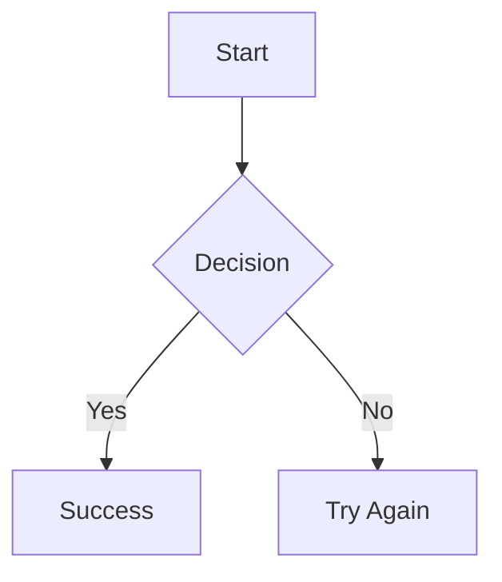
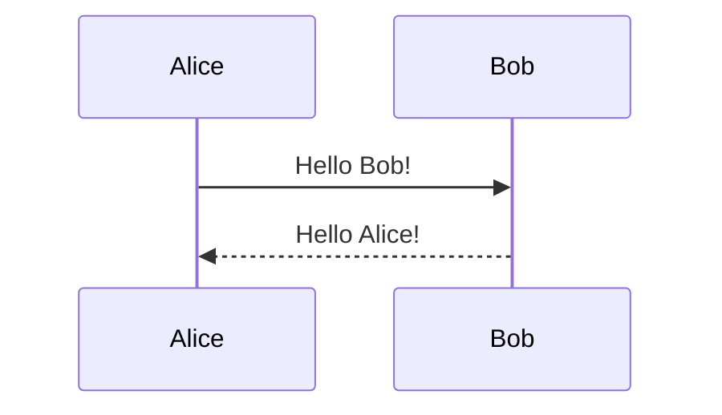
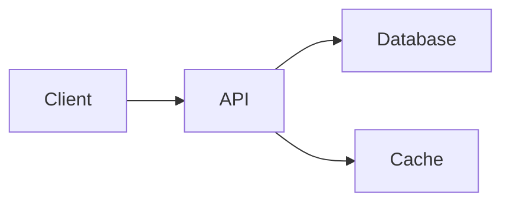

A comprehensive Markdown reference/test document containing common Markdown and GitHub-Flavored Markdown (GFM) syntax.

# Generating a new SSH key and adding it to the ssh-agent

After you've checked for existing SSH keys, you can generate a new SSH key to use for authentication, then add it to the ssh-agent.

## About SSH key passphrases

You can access and write data in repositories on GitHub using SSH (Secure Shell Protocol). When you connect via SSH, you authenticate using a private key file on your local machine. For more information, see [About SSH](/en/authentication/connecting-to-github-with-ssh/about-ssh).

When you generate an SSH key, you can add a passphrase to further secure the key. Whenever you use the key, you must enter the passphrase. If your key has a passphrase and you don't want to enter the passphrase every time you use the key, you can add your key to the SSH agent. The SSH agent manages your SSH keys and remembers your passphrase.

If you don't already have an SSH key, you must generate a new SSH key to use for authentication. If you're unsure whether you already have an SSH key, you can check for existing keys. For more information, see [Checking for existing SSH keys](/en/authentication/connecting-to-github-with-ssh/checking-for-existing-ssh-keys).

If you want to use a hardware security key to authenticate to GitHub, you must generate a new SSH key for your hardware security key. You must connect your hardware security key to your computer when you authenticate with the key pair. For more information, see the [OpenSSH 8.2 release notes](https://www.openssh.com/txt/release-8.2).

## Generating a new SSH key

You can generate a new SSH key on your local machine. After you generate the key, you can add the public key to your account on GitHub.com to enable authentication for Git operations over SSH.

> \[!NOTE]
> GitHub improved security by dropping older, insecure key types on March 15, 2022.
>
> As of that date, DSA keys (`ssh-dss`) are no longer supported. You cannot add new DSA keys to your personal account on GitHub.
>
> RSA keys (`ssh-rsa`) with a `valid_after` before November 2, 2021 may continue to use any signature algorithm. RSA keys generated after that date must use a SHA-2 signature algorithm. Some older clients may need to be upgraded in order to use SHA-2 signatures.

1. Open <span class="platform-mac">Terminal</span><span class="platform-linux">Terminal</span><span class="platform-windows">Git Bash</span>.

2. Paste the text below, replacing the email used in the example with your GitHub email address.

   ```shell
   ssh-keygen -t ed25519 -C "your_email@example.com"
   ```

   > \[!NOTE]
   > If you are using a legacy system that doesn't support the Ed25519 algorithm, use:
   >
   > ```shell
   > ssh-keygen -t rsa -b 4096 -C "your_email@example.com"
   > ```

   This creates a new SSH key, using the provided email as a label.

   ```shell
   > Generating public/private ALGORITHM key pair.
   ```

   When you're prompted to "Enter a file in which to save the key", you can press **Enter** to accept the default file location. Please note that if you created SSH keys previously, ssh-keygen may ask you to rewrite another key, in which case we recommend creating a custom-named SSH key. To do so, type the default file location and replace id_ALGORITHM with your custom key name.

   <div class="ghd-tool mac">

   ```shell
   > Enter a file in which to save the key (/Users/YOU/.ssh/id_ALGORITHM): [Press enter]
   ```

   </div>

   <div class="ghd-tool windows">

   ```powershell
   > Enter file in which to save the key (/c/Users/YOU/.ssh/id_ALGORITHM):[Press enter]
   ```

   </div>

   <div class="ghd-tool linux">

   ```shell
   > Enter a file in which to save the key (/home/YOU/.ssh/id_ALGORITHM):[Press enter]
   ```

   </div>

3. At the prompt, type a secure passphrase. For more information, see [Working with SSH key passphrases](/en/authentication/connecting-to-github-with-ssh/working-with-ssh-key-passphrases).

   ```shell
   > Enter passphrase (empty for no passphrase): [Type a passphrase]
   > Enter same passphrase again: [Type passphrase again]
   ```

## Adding your SSH key to the ssh-agent

Before adding a new SSH key to the ssh-agent to manage your keys, you should have checked for existing SSH keys and generated a new SSH key. <span class="platform-mac">When adding your SSH key to the agent, use the default macOS `ssh-add` command, and not an application installed by [macports](https://www.macports.org/), [homebrew](https://brew.sh/), or some other external source.</span>

<div class="ghd-tool mac">

1. Start the ssh-agent in the background.

   ```shell
   $ eval "$(ssh-agent -s)"
   > Agent pid 59566
   ```

   Depending on your environment, you may need to use a different command. For example, you may need to use root access by running `sudo -s -H` before starting the ssh-agent, or you may need to use `exec ssh-agent bash` or `exec ssh-agent zsh` to run the ssh-agent.

2. If you're using macOS Sierra 10.12.2 or later, you will need to modify your `~/.ssh/config` file to automatically load keys into the ssh-agent and store passphrases in your keychain.
   - First, check to see if your `~/.ssh/config` file exists in the default location.

     ```shell
     $ open ~/.ssh/config
     > The file /Users/YOU/.ssh/config does not exist.
     ```

   - If the file doesn't exist, create the file.

     ```shell
     touch ~/.ssh/config
     ```

   - Open your `~/.ssh/config` file, then modify the file to contain the following lines. If your SSH key file has a different name or path than the example code, modify the filename or path to match your current setup.

     ```text copy
     Host github.com
       AddKeysToAgent yes
       UseKeychain yes
       IdentityFile ~/.ssh/id_ed25519
     ```

     > \[!NOTE]
     >
     > - If you chose not to add a passphrase to your key, you should omit the `UseKeychain` line.
     > - If you see a `Bad configuration option: usekeychain` error, add an additional line to the configuration's' `Host *.github.com` section.
     >
     > ```text copy
     > Host github.com
     >   IgnoreUnknown UseKeychain
     > ```

3. Add your SSH private key to the ssh-agent and store your passphrase in the keychain. If you created your key with a different name, or if you are adding an existing key that has a different name, replace _id_ed25519_ in the command with the name of your private key file.

   ```shell
   ssh-add --apple-use-keychain ~/.ssh/id_ed25519
   ```

   > \[!NOTE]
   > The `--apple-use-keychain` option stores the passphrase in your keychain for you when you add an SSH key to the ssh-agent. If you chose not to add a passphrase to your key, run the command without the `--apple-use-keychain` option.
   >
   > The `--apple-use-keychain` option is in Apple's standard version of `ssh-add`. In macOS versions prior to Monterey (12.0), the `--apple-use-keychain` and `--apple-load-keychain` flags used the syntax `-K` and `-A`, respectively.
   >
   > If you don't have Apple's standard version of `ssh-add` installed, you may receive an error. For more information, see [Error: ssh-add: illegal option -- apple-use-keychain](/en/authentication/troubleshooting-ssh/error-ssh-add-illegal-option----apple-use-keychain).
   >
   > If you continue to be prompted for your passphrase, you may need to add the command to your `~/.zshrc` file (or your `~/.bashrc` file for bash).

4. Add the SSH public key to your account on GitHub. For more information, see [Adding a new SSH key to your GitHub account](/en/authentication/connecting-to-github-with-ssh/adding-a-new-ssh-key-to-your-github-account).

</div>

<div class="ghd-tool windows">

If you have [GitHub Desktop](https://desktop.github.com/) installed, you can use it to clone repositories and not deal with SSH keys.

1. In a new _admin elevated_ PowerShell window, ensure the ssh-agent is running. You can use the "Auto-launching the ssh-agent" instructions in [Working with SSH key passphrases](/en/authentication/connecting-to-github-with-ssh/working-with-ssh-key-passphrases), or start it manually:

   ```powershell
   # start the ssh-agent in the background
   Get-Service -Name ssh-agent | Set-Service -StartupType Manual
   Start-Service ssh-agent
   ```

2. In a terminal window without elevated permissions, add your SSH private key to the ssh-agent.
   If you created your key with a different name, or if you are adding an existing key that has a different name, replace _id_ed25519_ in the command with the name of your private key file.

   ```powershell
   ssh-add c:/Users/YOU/.ssh/id_ed25519
   ```

3. Add the SSH public key to your account on GitHub. For more information, see [Adding a new SSH key to your GitHub account](/en/authentication/connecting-to-github-with-ssh/adding-a-new-ssh-key-to-your-github-account).

> ### Troubleshooting SSH agent conflicts in Windows
>
> In Windows environments, the native Windows OpenSSH implementation and the one included with [Git for Windows](https://gitforwindows.org/) (based on MSYS2/Bash) can coexist.
>
> If you configure and save your passphrases in the Windows agent using PowerShell, Git may still prompt you for your passphrase during operations like `git push`. This can happen when Git for Windows uses its bundled `ssh.exe` (from MSYS2) instead of the Windows system OpenSSH client, and therefore can't talk to the Windows `ssh-agent` service.
>
> To ensure Git uses the agent where you've stored your credentials, force Git to use the system's SSH binary by running:
>
> ```powershell
> git config --global core.sshCommand "C:/Windows/System32/OpenSSH/ssh.exe"
> ```
>
> You may need to specify which `ssh-keygen` binary Git should use to avoid conflicts with the binary bundled with Git for Windows. To define which binary is used, run the following command:
>
> ```powershell
> git config --global gpg.ssh.program "C:/Windows/System32/OpenSSH/ssh-keygen.exe"
> ```
>
> Alternatively, you can reinstall Git for Windows and select the **Use external OpenSSH** option during the installation process.

</div>

<div class="ghd-tool linux">

1. Start the ssh-agent in the background.

   ```shell
   $ eval "$(ssh-agent -s)"
   > Agent pid 59566
   ```

   Depending on your environment, you may need to use a different command. For example, you may need to use root access by running `sudo -s -H` before starting the ssh-agent, or you may need to use `exec ssh-agent bash` or `exec ssh-agent zsh` to run the ssh-agent.

2. Add your SSH private key to the ssh-agent.

   If you created your key with a different name, or if you are adding an existing key that has a different name, replace _id_ed25519_ in the command with the name of your private key file.

   ```shell
   ssh-add ~/.ssh/id_ed25519
   ```

3. Add the SSH public key to your account on GitHub. For more information, see [Adding a new SSH key to your GitHub account](/en/authentication/connecting-to-github-with-ssh/adding-a-new-ssh-key-to-your-github-account).

</div>

## Generating a new SSH key for a hardware security key

If you are using macOS or Linux, you may need to update your SSH client or install a new SSH client prior to generating a new SSH key. For more information, see [Error: Unknown key type](/en/authentication/troubleshooting-ssh/error-unknown-key-type).

1. Insert your hardware security key into your computer.

2. Open <span class="platform-mac">Terminal</span><span class="platform-linux">Terminal</span><span class="platform-windows">Git Bash</span>.

3. Paste the text below, replacing the email address in the example with the email address associated with your GitHub account.

   <div class="ghd-tool mac">

   ```shell
   ssh-keygen -t ed25519-sk -C "your_email@example.com"
   ```

   </div>

   <div class="ghd-tool windows">

   ```powershell
   ssh-keygen -t ed25519-sk -C "your_email@example.com"
   ```

   </div>

   <div class="ghd-tool linux">

   ```shell
   ssh-keygen -t ed25519-sk -C "your_email@example.com"
   ```

   </div>

   > \[!NOTE]
   > If the command fails and you receive the error `invalid format` or `feature not supported,` you may be using a hardware security key that does not support the Ed25519 algorithm. Enter the following command instead.
   >
   > ```shell
   > ssh-keygen -t ecdsa-sk -C "your_email@example.com"
   > ```

4. When you are prompted, touch the button on your hardware security key.

5. When you are prompted to "Enter a file in which to save the key," press Enter to accept the default file location.

   <div class="ghd-tool mac">

   ```shell
   > Enter a file in which to save the key (/Users/YOU/.ssh/id_ed25519_sk): [Press enter]
   ```

   </div>

   <div class="ghd-tool windows">

   ```shell
   > Enter a file in which to save the key (c:\Users\YOU\.ssh\id_ed25519_sk):[Press enter]
   ```

   </div>

   <div class="ghd-tool linux">

   ```shell
   > Enter a file in which to save the key (/home/YOU/.ssh/id_ed25519_sk):[Press enter]
   ```

   </div>

6. When you are prompted to type a passphrase, press **Enter**.

   ```shell
   > Enter passphrase (empty for no passphrase): [Type a passphrase]
   > Enter same passphrase again: [Type passphrase again]
   ```

7. Add the SSH public key to your account on GitHub. For more information, see [Adding a new SSH key to your GitHub account](/en/authentication/connecting-to-github-with-ssh/adding-a-new-ssh-key-to-your-github-account).

## Further reading

- [GitHub credential types reference](/en/organizations/managing-programmatic-access-to-your-organization/github-credential-types)

---

## 1. Headings

# Heading 1

## Heading 2

### Heading 3

#### Heading 4

##### Heading 5

###### Heading 6

# Alternative H1

## Alternative H2

---

## 2. Paragraphs

This is a normal paragraph.

This is another paragraph separated by a blank line.

This paragraph contains a line break
using two trailing spaces.

This paragraph contains a
hard line break using a backslash.

---

## 3. Emphasis

_Italic text_

_Italic text_

**Bold text**

**Bold text**

**_Bold italic text_**

**_Bold italic text_**

~~Strikethrough text~~

**Bold with _italic_ inside**

_Italic with **bold** inside_

---

## 4. Inline Code

Use `inline code` inside a sentence.

Use `` `code containing a backtick` `` with double backticks.

---

## 5. Links

[Basic link](https://example.com)

[Link with title](https://example.com 'Example website')

https://example.com

[email@example.com](mailto:email@example.com)

Automatic URL: https://example.com

---

## 6. Images


---

## 7. Blockquotes

> This is a blockquote.

> This is a multiline blockquote.
>
> It contains multiple paragraphs.

> Nested quote:
>
> > This is a nested blockquote.
> >
> > With another paragraph.

---

## 8. Unordered Lists

- Item one
- Item two
- Item three

Alternative markers:

- Item one
- Item two
- Item three

* Item one
* Item two
* Item three

Nested list:

- Parent
  - Child
    - Grandchild
      - Great-grandchild

  - Another child

- Another parent

---

## 9. Ordered Lists

1. First item
2. Second item
3. Third item

Nested ordered list:

1. First
   1. Nested first
   2. Nested second

2. Second
   1. Nested item

Automatic numbering:

1. First item
2. Second item
3. Third item

---

## 10. Task Lists

- [ ] Unchecked task
- [x] Checked task
- [ ] Another unchecked task
- [x] Also checked

Nested tasks:

- [ ] Main task
  - [ ] Subtask
  - [x] Completed subtask

---

## 11. Horizontal Rules

---

---

---

---

---

---

## 12. Code Blocks

Inline:

This is a piece of code `const value = 42;` which is part of my story.

Indented code:

```
const value = 42;
console.log(value);
```

Fenced code:

```text
Plain text code block
```

JavaScript:

```javascript
const greeting = 'Hello, world!'
console.log(greeting)
```

Python:

```python
def hello(name):
    return f"Hello, {name}!"

print(hello("World"))
```

JSON:

```json
{
  "name": "Example",
  "enabled": true,
  "items": [1, 2, 3]
}
```

HTML:

```html
<div class="example">
  <p>Hello, world!</p>
</div>
```

---

## 13. Tables

| Name    | Age | Country     |
| ------- | --: | ----------- |
| Alice   |  30 | Netherlands |
| Bob     |  25 | Germany     |
| Charlie |  35 | Belgium     |

Alignment:

| Left | Center | Right |
| :--- | :----: | ----: |
| A    |   B    |     C |
| 1    |   2    |     3 |
| foo  |  bar   |   baz |

Formatting inside tables:

| Feature  | Example                        |
| -------- | ------------------------------ |
| **Bold** | **text**                       |
| _Italic_ | _text_                         |
| `Code`   | `code`                         |
| Link     | [Example](https://example.com) |

---

## 14. Escaping Characters

_Not italic_

_Not italic_

# Not a heading

\(Not a link\)

> Not a blockquote

`Not code`

$$
Backslash

Escaped punctuation:

\! \# \$ \% \& \( \) \* \+ \- \. \: \; \< \= \> \? \@ \[ \] \^ \_ \{ \} \| \~

---

## 15. HTML

Inline HTML:

<span>Inline HTML</span>

<div>
  <strong>Bold HTML</strong>
</div>

HTML paragraph:

<p>This is an HTML paragraph.</p>

HTML line break:

Line one<br>
Line two

HTML details:

<details>
<summary>Click to expand</summary>

Hidden content goes here.

</details>

---

## 16. Definition-Style / Reference Links

This uses a reference-style link:

[OpenAI][openai]

[OpenAI]: https://openai.com/

Implicit reference:

[OpenAI][]

[openai]: https://openai.com/

---

## 17. Footnotes

Here is a sentence with a footnote.[^1]

Here is another footnote reference.[^long-note]

[^1]: This is the first footnote.

[^long-note]: This is a longer footnote containing **Markdown formatting**.

---

## 18. Abbreviations

HTML

*[HTML]: HyperText Markup Language

---

## 19. Superscript and Subscript

Depending on the Markdown implementation:

H~2~O

X^2^

---

## 20. Highlighting

Some Markdown implementations support:

==Highlighted text==

---

## 21. Emojis

:smile:

:+1:

:rocket:

:heart:

😀 😎 🚀 ❤️ 👍 🎉

---

## 22. Mathematical Notation

Inline math:

$E = mc^2$

Block math:


$$

E = mc^2

$$

Another example:


$$

\int_0^1 x^2\,dx = \frac{1}{3}

$$

---

## 23. LaTeX Examples

Inline:

$\alpha + \beta = \gamma$

Block:


$$

\begin{aligned}
a^2 + b^2 &= c^2 \\
E &= mc^2
\end{aligned}

$$

Matrix:


$$

\begin{bmatrix}
1 & 2 \\
3 & 4
\end{bmatrix}

$$

---

## 24. Mermaid



Sequence diagram:



---

## 25. Alerts / Admonitions

GitHub-style alerts:

> [!NOTE]
> This is a note.

> [!TIP]
> This is a useful tip.

> [!IMPORTANT]
> This is important information.

> [!WARNING]
> This is a warning.

> [!CAUTION]
> This is a caution.

---

## 26. GitHub Mentions

@github

#123

user/repository#123

Commit reference:

`abcdef1`

---

## 27. GitHub-Specific Links

Issue:

#123

Pull request:

#456

Repository:

user/repository

---

## 28. Automatic Linking

https://example.com

http://example.com

www.example.com

example@example.com

---

## 29. Characters With Special Meaning

# Heading

* emphasis
_ emphasis
** strong
__ strong
- list
+ list
1. ordered list
> quote
` code
``` fenced code
[ link ](url)

--- horizontal rule

---

## 30. Unicode

Plain Unicode:

Hello, 世界!

Bonjour, le monde !

Hallo, Welt!

Привет, мир!

مرحبا بالعالم

שלום עולם

नमस्ते दुनिया

こんにちは、世界！

안녕하세요, 세계!

Emoji:

😀 😃 😄 😁 😆 😅 😂 🤣

---

## 31. Mixed Formatting

**Bold with `inline code` and [a link](https://example.com).**

> A quote containing **bold**, *italic*, `code`, and [a link](https://example.com).

- **Bold item**
- *Italic item*
- `Code item`
- [Linked item](https://example.com)
- ~~Deleted item~~

---

## 32. Nested Everything

> **Important:** This quote contains:
>
> - a list
> - with `inline code`
> - **bold text**
> - *italic text*
> - [a link](https://example.com)
>
> ```javascript
> console.log("nested code");
> ```

---

## 33. Long Text

Lorem ipsum dolor sit amet, consectetur adipiscing elit. **Bold text** and *italic text* can appear in the same paragraph. `Inline code` can also appear alongside [links](https://example.com), while Markdown processors may interpret different extensions differently.

---

## 34. Empty / Edge Cases

Empty list item:

-

Empty emphasis:

****

****

Empty link:

[]()

Empty image:


Multiple spaces:

Text     with     multiple     spaces.

Trailing spaces:

Line one
Line two

---

## 35. Escaped Markdown

\# This is not a heading

\* This is not italic

\** This is not bold

\[This is not a link\]

\> This is not a quote

\- This is not a list item

\`This is not code\`

---

## 36. Literal Markdown

```markdown
# This heading is inside a code block

**This is not bold**

- This is not a real list

[This is not a real link](https://example.com)
```

---

## 37. Nested Lists With Different Types

1. Ordered item
   - Unordered child
   - Another child
     1. Ordered grandchild
     2. Another grandchild
2. Another ordered item

---

## 38. Table With Complex Content

| Syntax | Rendering |
|:-------|:----------|
| `**bold**` | **bold** |
| `*italic*` | *italic* |
| `~~strike~~` | ~~strike~~ |
| `` `code` `` | `code` |
| `[link](https://example.com)` | [link](https://example.com) |
| `` | image |
| `$x^2$` | $x^2$ |

---

## 39. Special Characters

Ampersand: &

Less than: <

Greater than: >

Quotes: "double" and 'single'

Backtick: `

Tilde: ~

Pipe: |

Backslash: \

Brackets: [ ]

Braces: { }

Parentheses: ( )

---

## 40. End-to-End Example

# Project Documentation

> **Note:** This is an example combining many Markdown features.

## Overview

This project demonstrates **Markdown** syntax, including:

- *Emphasis*
- `Inline code`
- [Links](https://example.com)
- Lists
- Tables
- Task lists

### Installation

```bash
git clone https://example.com/project.git
cd project
npm install
```

### Configuration

| Variable | Required | Default |
|----------|:--------:|---------|
| `PORT` | Yes | `3000` |
| `DEBUG` | No | `false` |

### Tasks

- [x] Create project
- [x] Add documentation
- [ ] Add tests
- [ ] Release version 1.0

### Architecture



### Formula

The project uses the following formula:


$$

f(x) = x^2 + 2x + 1

$$

### Warning

> [!WARNING]
> Do not use this configuration in production without reviewing the security settings.

### More Information

Read the [project documentation](https://example.com/docs).

---

## 41. End of Test File

This document intentionally contains a wide variety of Markdown syntax to test Markdown parsers, renderers, editors, converters, and syntax highlighters.
$$
